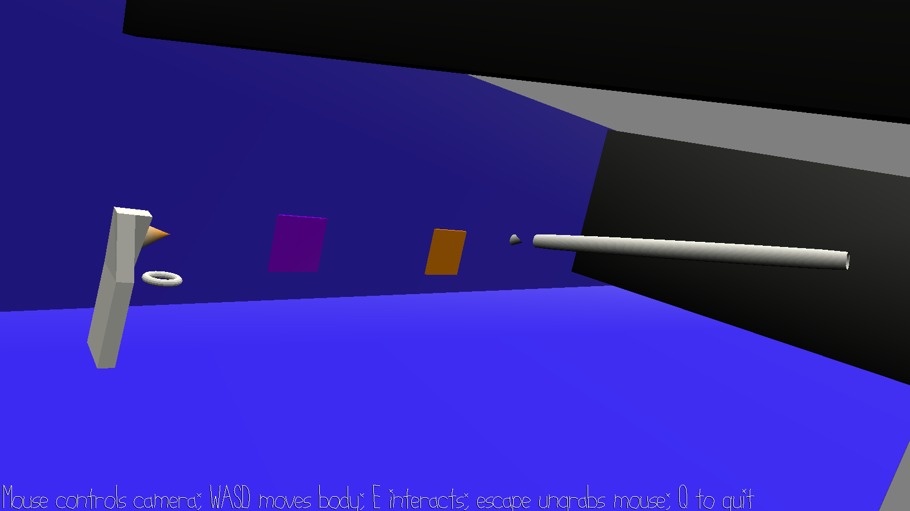

# Out of Body

Author: Dominic Calkosz

Design: A short 3D puzzle game that separates the player from their camera.

Screen Shot:

How To Play:

* WASD to move your body.
* Mouse to look around with the camera.
* Left/right mouse button to slide the camera.
* E to interact.
* escape to ungrab the mouse.
* Q to quit.

Sources: All assets haphazardly made by me in Blender.

This game was built with [NEST](NEST.md).

